<p align="center">
  
</p>

# 💳 Awesome Corporate Card & Spend Platform

<p align="center">
  <a href="https://github.com/ishandutta2007/Awesome-Awesome-Awesome"></a><a href="https://discord.gg/jc4xtF58Ve"></a>
  <a href="https://github.com/ishandutta2007/Awesome-Corporate-Card-Platform/stargazers"></a>
  <a href="https://github.com/ishandutta2007/Awesome-Corporate-Card-Platform/network/members"></a>
  <a href="https://github.com/ishandutta2007/Awesome-Corporate-Card-Platform/issues"></a>
  <a href="https://github.com/ishandutta2007/Awesome-Corporate-Card-Platform/blob/main/LICENSE"></a>
  <a href="https://github.com/ishandutta2007/Awesome-Corporate-Card-Platform/pulls"></a>
  <a href="https://github.com/ishandutta2007"></a>
</p>

---

## 🌟 Top Corporate Card & Modern Spend Management Ecosystem

> **Curated List of Commercial SaaS Products, Virtual Card Issuers & Open-Source Financial Software**  
> *Targeted at Corporate Credit Cards, Real-Time Spend Controls, Expense Management, Virtual Cards, AP Automation & Automated Accounting Reconciliation.*

📅 **Last updated: August 2026**

---

### 📖 Overview & SEO Index

This repository serves as a definitive index and technical guide to leading **Corporate Card Platforms**, **B2B Spend Management Software**, and **Self-Hosted Financial Stacks**. Whether you are a venture-backed startup, high-growth scaleup, enterprise finance department, or open-source self-hoster, this list helps you compare:

- 💳 **Physical & Virtual Corporate Cards** with automated receipt matching and custom spending policies.
- ⚡ **Real-Time Spend Controls & Budgets** that prevent overspending before swipe.
- 🔄 **Automated Reconciliation & Multi-Entity Bookkeeping** syncing directly to QuickBooks, Xero, NetSuite, and Sage.
- 🔐 **Accounts Payable (AP) & Invoice Processing** with optical character recognition (OCR) and approval workflows.
- 🛠️ **Open-Source Expense Trackers & Bookkeeping Engines** for data sovereignty, custom card parsing, and privacy.

---

## 📑 Table of Contents

- [🏢 SaaS & Hosted Platforms](#-saas--hosted-platforms)
- [🌐 Open-Source GitHub Projects](#-open-source-github-projects)
- [🏗️ Architectural Guide: Building Custom Spend Stacks](#️-architectural-guide-building-custom-spend-stacks)
- [⭐ Star History](#-star-history)
- [🤝 How to Contribute](#-how-to-contribute)
- [⚠️ Disclaimer](#️-disclaimer)

---

## 🏢 SaaS & Hosted Platforms

Below is a comparison of top commercial corporate card and spend management platforms, sorted by **Company Scale (Valuation / Revenue)** in descending order:

| 🏢 Platform | 📝 Description | 📈 Company Scale (Valuation / Revenue) | 💰 Pricing | 🎁 Free Tier / Trial Limits |
| :--- | :--- | :--- | :--- | :--- |
| **[Ramp](https://ramp.com/)** | Leading corporate card and automated spend management platform known for high cashback, real-time expense controls, and AI-driven accounting automation. | **$44.0B Valuation** ($1B+ Annualized Revenue) | Free ($0/user/mo for Core plan); $15/user/mo for Ramp Plus ($12/user/mo billed annually) | Free-forever Core plan includes unlimited virtual/physical cards, unlimited users, core expense management, and basic accounting sync. Plus tier offers a 30-day free trial. |
| **[Brex](https://www.brex.com/)** | Corporate card, global spend management, and venture banking platform built for high-growth startups and scaling global enterprises. | **$5.15B Valuation** (Acquired by Capital One; $300M+ ARR) | Free ($0/user/mo for Essentials plan); $12/user/mo for Premium plan | Free-forever Essentials plan includes unlimited users and cards, spend management, travel booking, and bill pay (requires LLC/Corp entity and $50k+ cash balance). |
| **[Pleo](https://www.pleo.io/)** | European smart corporate card and automated expense management platform with on-the-spot receipt capture, mileage tracking, and multi-currency support. | **$4.7B Valuation** (~$150M ARR) | Starter starts at £9.50/mo (billed annually for 3 users); Essential starts at £39/mo for 3 users (+£11/additional user/mo) | No permanent free plan. Offers a 14-day free trial on Starter and Essential plans with full access to physical/virtual cards, automated receipt capture, and accounting sync. |
| **[Divvy by BILL (BILL Spend & Expense)](https://www.bill.com/)** | Budget-first corporate card and real-time expense management software tightly integrated into the BILL AP/AR automation suite. | **~$4.3B Market Cap** (Parent BILL) / $2.5B Divvy Acquisition | Free ($0/mo platform subscription, $0/user, $0/card) | Free-forever full access with unlimited users, unlimited physical & virtual credit cards, custom budgets, expense approvals, and accounting integrations (monetized via merchant interchange fees). |
| **[Rho](https://www.rho.co/)** | Integrated commercial banking, corporate credit cards, accounts payable automation, and treasury management for mid-market organizations. | **~$1.5B Valuation** | Free ($0/mo platform subscription, $0/user, $0/card) | Free-forever full access with unlimited users, physical/virtual corporate cards, AP automation, and banking integrations. Only standard transactional fees apply (e.g., 1% FX transfer fee, $15 SWIFT). |
| **[Moss](https://www.getmoss.com/)** | Comprehensive European corporate card, invoice management, and automated accounting platform with deep DATEV and ERP integrations. | **€1.0B Valuation** (~$1.1B Unicorn status) | Free (€0/mo on Free Plan); Paid modular plans start from ~€99/mo | Free-forever plan limited to up to 3 users, up to 20 invoices/month, unlimited cards (debit wallet only), and basic approval workflows. Custom demo for paid modular tiers. |
| **[Mesh Payments](https://meshpayments.com/)** | Global spend management and virtual corporate card platform specialized in multi-currency controls, SaaS subscription management, and travel. | **$1.0B Valuation** ($200M+ Total Funding) | Free ($0/mo for Pro tier up to 3 users); Premium starts at $10/user/mo | Free-forever Pro plan limited to up to 3 users with unlimited cards, cashback on spend, and core spend management. Guided trial available on request for larger teams. |
| **[Emburse Cards](https://www.emburse.com/)** | Enterprise-grade physical and virtual card issuing platform part of the Emburse travel and spend management ecosystem. | **>$300M Annual Revenue** (Enterprise Scale) | Basic starts at $8/user/mo ($7/user/mo billed annually); Plus at $12/user/mo ($11/user/mo billed annually) | No permanent free software plan (card issuing has $0 fee). Offers a 30-day free trial with full access to card controls, receipt OCR, accounting sync, and up to 50 monthly ACH reimbursements. |
| **[Soldo](https://www.soldo.com/)** | Multi-user prepaid card and expense management infrastructure designed for European businesses needing flexible spend delegation. | **~$800M Est. Valuation** ($310M Funding Raised) | Standard starts at £21/mo (includes base card allocation; +£7/additional user/mo); Plus starts at £33/mo | No permanent free plan. Offers a 30-day free trial on Standard and Plus tiers with full access to multi-user spend controls, cards, and reporting (standard transactional/ATM fees apply). |
| **[Airbase](https://www.airbase.com/)** | Procure-to-pay, corporate card, and AP automation system engineered for mid-market and enterprise accounting workflows. | **~$325M Acquisition** (Paylocity) | Standard tier starts from ~$3,000–$6,000/yr (~$250–$500/mo billed annually for up to 200 employees) | No permanent free plan. Offers a 14-day free trial and guided sandbox access upon sales demo to test card issuance and spend workflows. |

---

## 🌐 Open-Source GitHub Projects

Because commercial card issuing requires licensed banking charters and payment network integration (Visa/Mastercard), pure open-source platforms cannot directly issue interchange-backed credit cards. However, open-source projects excel at **self-hosted expense tracking, budget control, bank statement parsing, double-entry bookkeeping, and receipt OCR**.

Sorted by **GitHub Stars (Descending)**:

- **[Maybe](https://github.com/maybe-finance/maybe)** [](https://github.com/maybe-finance/maybe/stargazers)  
  Modern personal finance, net worth, and spend tracking application built with Ruby on Rails, PostgreSQL, and Hotwire. Features comprehensive transaction categorization and investment tracking.

- **[Odoo](https://github.com/odoo/odoo)** [](https://github.com/odoo/odoo/stargazers)  
  Comprehensive open-source business management suite featuring dedicated Expense Management, Employee Corporate Card integration, multi-level approvals, OCR receipt scanning, and automatic bank feed reconciliation.

- **[Actual Budget](https://github.com/actualbudget/actual)** [](https://github.com/actualbudget/actual/stargazers)  
  Privacy-focused, local-first zero-based budgeting system with end-to-end encryption, multi-device synchronization, bank syncing, and automated rule-based transaction tagging.

- **[Firefly III](https://github.com/firefly-iii/firefly-iii)** [](https://github.com/firefly-iii/firefly-iii/stargazers)  
  Mature, self-hosted personal and business finance manager featuring full double-entry bookkeeping, rule engines, recurring budgets, multi-currency support, and comprehensive REST API integrations.

- **[ERPNext](https://github.com/frappe/erpnext)** [](https://github.com/frappe/erpnext/stargazers)  
  Full-featured open-source ERP offering robust Expense Claim workflows, Employee Corporate Card transaction logs, Purchase Order matching, and automated accounts payable reconciliation.

- **[Invoice Ninja](https://github.com/invoiceninja/invoiceninja)** [](https://github.com/invoiceninja/invoiceninja/stargazers)  
  Leading self-hosted invoicing, billing, payment processing, and business expense management platform designed for freelancers and small-to-mid businesses.

- **[Wallos](https://github.com/wallosapp/wallos)** [](https://github.com/wallosapp/wallos/stargazers)  
  Self-hosted, open-source subscription and recurring card expense management tracker with budgeting, statistical insights, renewal reminders, and multi-currency support.

- **[Ledger](https://github.com/ledger/ledger)** [](https://github.com/ledger/ledger/stargazers)  
  High-performance, command-line double-entry accounting system that parses plain-text transaction logs, perfect for automated corporate statement processing and audit trails.

- **[Beancount](https://github.com/beancount/beancount)** [](https://github.com/beancount/beancount/stargazers)  
  Plain-text double-entry bookkeeping engine optimized for Python-based data pipelines, custom transaction tagging, statement parsing, and financial reporting.

- **[Money Manager Ex](https://github.com/moneymanagerex/moneymanagerex)** [](https://github.com/moneymanagerex/moneymanagerex/stargazers)  
  Cross-platform, intuitive personal and small-business financial management software with credit card transaction tracking, cash-flow forecasting, and budgeting tools.

- **[Impensa](https://github.com/neiios/impensa)** [](https://github.com/neiios/impensa/stargazers)  
  Simple open-source expense management application with visualization dashboards, spend categorization, and receipt data export.

- **[Wally](https://github.com/polius/Wally)** [](https://github.com/polius/Wally/stargazers)  
  Lightweight, self-hosted expense tracker with clean UI, transaction tagging, categorization, and CSV import/export capabilities.

---

## 🏗️ Architectural Guide: Building Custom Spend Stacks

```
  ┌─────────────────────────────────────────────────────────────┐
  │                 Corporate Payment Network                   │
  │    (Visa / Mastercard / Banking Partner / Virtual Cards)    │
  └──────────────────────────────┬──────────────────────────────┘
                                 │ Real-Time Webhooks / OFX Feeds
                                 ▼
  ┌─────────────────────────────────────────────────────────────┐
  │               Spend Controls & Policy Engine                │
  │    • Category Whitelisting / Merchant Locking               │
  │    • Real-Time Spend Limits & Multi-Tier Approvals          │
  └──────────────────────────────┬──────────────────────────────┘
                                 │
                                 ▼
  ┌─────────────────────────────────────────────────────────────┐
  │           Open-Source Tracking & Reconciliation Layer        │
  │    • Firefly III / Actual Budget (Double-Entry Ledger)      │
  │    • Receipt OCR & Automatic VAT / Tax Extraction           │
  │    • ERPNext / Odoo (AP Matching & Expense Claims)          │
  └─────────────────────────────────────────────────────────────┘
```

1. **Card Issuance Layer**: Use commercial card APIs or banking rails to generate virtual cards and receive transaction webhook notifications.
2. **Approval & Budgeting Layer**: Route transactions through workflow engines to enforce policy checks (e.g., software subscription limits, per-diem rules).
3. **Ledger & Audit Trail Layer**: Ingest normalized transaction streams into **Firefly III**, **Actual Budget**, or **ERPNext** for automated reconciliation against bank statements and general ledgers.

---

## ⭐ Star History

[](https://star-history.dera.page/#ishandutta2007/Awesome-Corporate-Card-Platform&type=date&legend=top-left)

---

## 🤝 How to Contribute

We welcome community contributions! To add a new platform or open-source tool:

1. 🍴 **Fork the repository**.
2. 🌿 **Create a feature branch** (`git checkout -b add-new-platform`).
3. 📝 **Add/edit entries in `README.md`** following the existing table and badge formats.
4. 🚀 **Submit a Pull Request** with a concise description of why the tool should be listed.

---

## ⚠️ Disclaimer

- This repository is a **community-curated index** created for educational and comparative purposes.
- Corporate cards involve regulated financial services (underwriting, issuing, payments). Open-source software manages accounting, budgets, and reporting but **cannot** replace licensed financial institutions.
- Always ensure compliance with accounting standards, local tax requirements, and data protection regulations when handling corporate financial data.

---

<p align="center">
  <sub>Made with ❤️ for finance teams, founders, developers, and operators worldwide.</sub>
</p>
